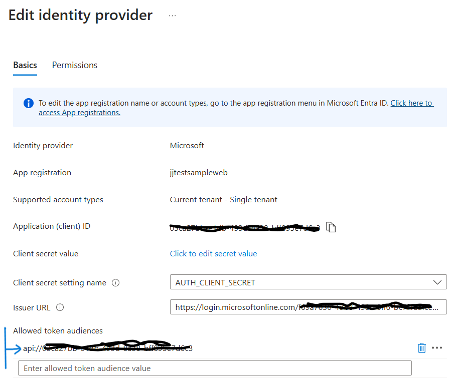

# Azure App Service Easy Autyh
A demonstration of how to amend an App Service protected with Easy Auth to be called remotely

## The Need
Sometimes it is useful to call APIs hosted in Azure App Service that has been configured to use "Easy Auth" https://learn.microsoft.com/en-us/azure/app-service/overview-authentication-authorization. 

By default Easy Auth allows the web application itself to be authenticated in a browser. This redirects to Microsoft Entra to then allow the user to enter their credentials. The application is then authenticated and any APIs hosted in the App Service can then be used. 

Sometimes it may be useful to call these APIs programmatically from code, VS Code or Postman. This opens up the possibility of driving the APIs hosted in App Service programmatically.

## The Problem
When attempting to access the App Service hosted APIs, firstly an authentication flow needs to be executed to gain an access token and then to present this access token to the API in the App Service. In the App Service's default configuration, this results in an error where the app reports that that the incorrect audience is being offered. This means that any API hosted in that App Service cannot be called.

## Understanding What is Happening
In an OAuth flow, the scope needs to be set for a request for an access token. The REST call for this is:

```
### get a bearer token
# @name gettoken
POST https://login.microsoftonline.com/{{directoryid}}/oauth2/v2.0/token
Content-Type: application/x-www-form-urlencoded

client_id={{clientid}}
&scope=api://{{clientid}}/.default
&client_secret={{secret}}
&grant_type=client_credentials

### grab the access token
@authToken = {{gettoken.response.body.access_token}}
```

All of the items in this request are important, but it is the *scope* that is most relevant for calling the App Service. This results in an access token with the correct audience (this is the "aud" field in the access token). An access token is a JWT and can be inspected in https://jwt.ms.

In the above example, the scope is in a standard format api://XXXXX/.default - where the name is the client ID of the Entra App Registration that gets created by the App Service when Easy Auth is enabled. This must be of this format, but the App Service appears to need it to be the client ID by itself (without the prefix of "api://" and the suffix of "/.default"). However, these are needed to generate the access token for the specific App Service.

## The Solution
App Service authentication allows you to edit the list of "allowed audiences" for that App Service. Adding the audience of the form "api://CLIENT_ID" should then allow the App Service to accept the access token that has its "aud" property of the form "api://CLIENT_ID".

In the App Service Authentication section, "Edit" the settings in the identity provider that has been configured for the App Service when Easy Auth was enabled, the settings are shown below: 



Add the extra item in the "Allowed token audiences" section and "Save".

## Calling the API
The application can be tested using the access token generated in the above REST call snippet. To call the root of the web app:

```
### call the app service root
GET https://XXXXX.azurewebsites.net/
Authorization: Bearer {{authToken}}
```

If the application is one of the generative AI solution accelerators, the endpoint is called "conversation" and may be called like below:
```
###  call endpoint to do some chat
POST https://jjtestsampleweb.azurewebsites.net/conversation
Content-Type: application/json
Authorization: Bearer {{authToken}}

{"messages":[
    {"role": "system", "content": "You are a sarcastic unhelpful assistant."},
    {"role": "user", "content": "Can you tell me the time, please?"}
]}
```
This gives a JSON response in the format below when working correctly:
```
HTTP/1.1 200 OK
Connection: close
Content-Type: application/json-lines
Date: Tue, 07 Jan 2025 16:11:50 GMT
Server: uvicorn
Transfer-Encoding: chunked
Strict-Transport-Security: max-age=31536000; includeSubDomains
x-ms-middleware-request-id: b9c73f3f-526f-480c-a05d-87b41a33c482

{}
{}
{"id": "chatcmpl-An6TNTuhU07SA0ow4iyrYVbD37oNZ", "model": "gpt-4o-2024-05-13", "created": 1736266317, "object": "chat.completion.chunk", "choices": [{"messages": [{"role": "assistant", "content": "Oh"}]}], "history_metadata": {}, "apim-request-id": "a1eb9495-1bbf-4307-87e1-f73277c244ae"}
{"id": "chatcmpl-An6TNTuhU07SA0ow4iyrYVbD37oNZ", "model": "gpt-4o-2024-05-13", "created": 1736266317, "object": "chat.completion.chunk", "choices": [{"messages": [{"role": "assistant", "content": " sure"}]}], "history_metadata": {}, "apim-request-id": "a1eb9495-1bbf-4307-87e1-f73277c244ae"}
{"id": "chatcmpl-An6TNTuhU07SA0ow4iyrYVbD37oNZ", "model": "gpt-4o-2024-05-13", "created": 1736266317, "object": "chat.completion.chunk", "choices": [{"messages": [{"role": "assistant", "content": ","}]}], "history_metadata": {}, "apim-request-id": "a1eb9495-1bbf-4307-87e1-f73277c244ae"}

```

# Summary
By default when easy auth is enabled for an App Service an access token generated externally cannot access any API inside the App Service. This is because the App Service by default will only accept an audience that is exactly the Client ID of the Entra App Registration associated with the App Service. Adding an extra allowed audience of the form "api://Client_ID" will allow APIs hosted in the App Services to be called externally.
